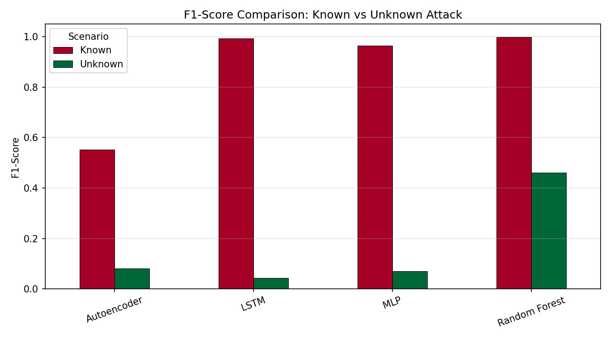
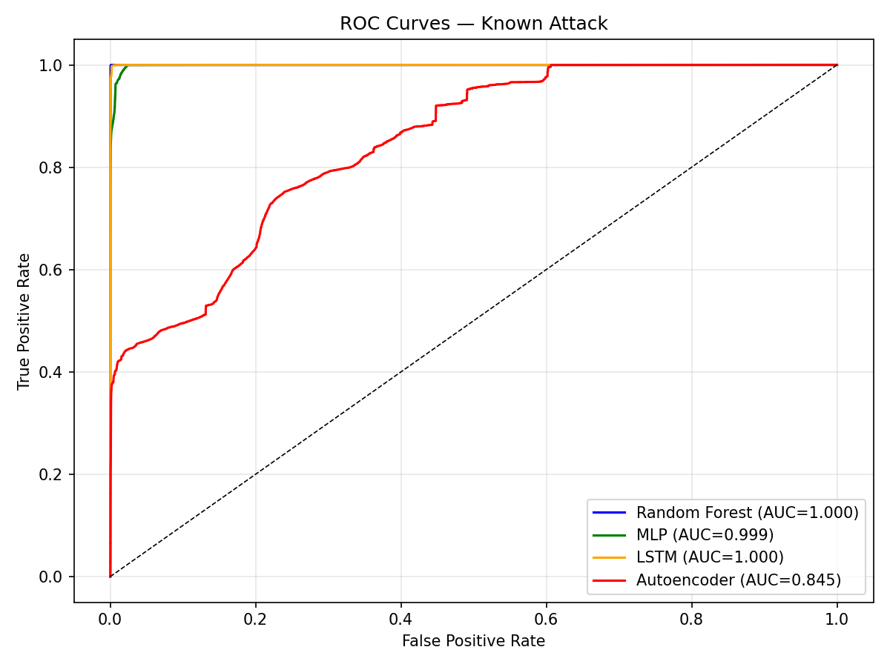
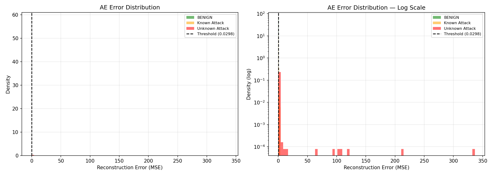
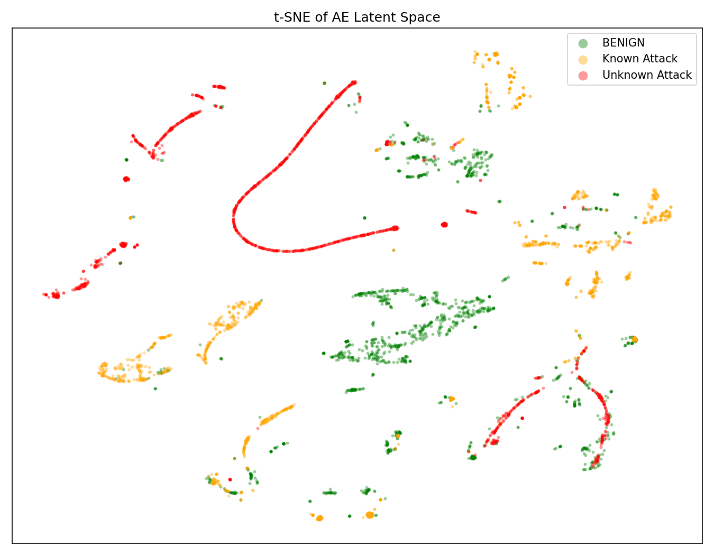
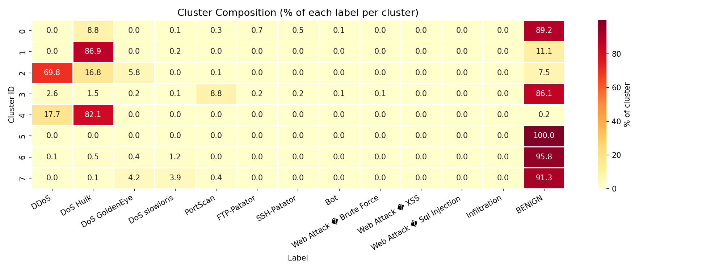
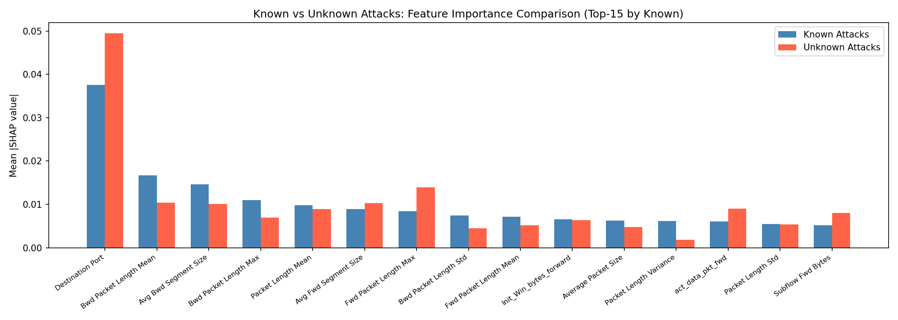
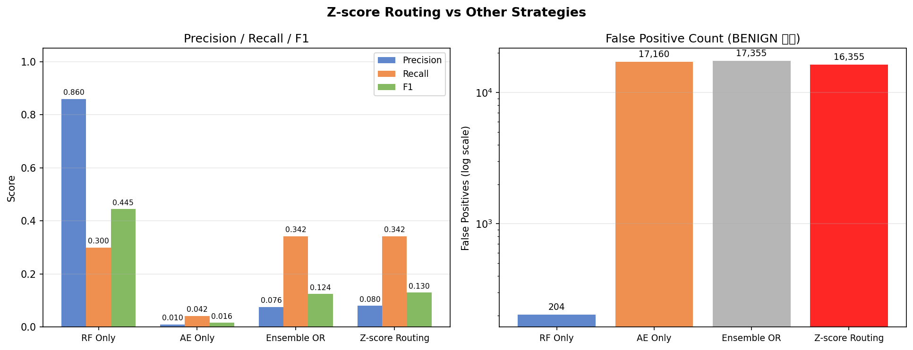

# The Limitations of Flow Statistics-Based IDS: Analyzing the Role of Autoencoders in Unknown Attack Detection

**Youngli Cho** | Introduction to Deep Learning

## Video Presentation

> [](https://youtu.be/auRB4NsH1ss)  
> *(Update this link after uploading your video)*

## Dataset

CICIDS2017 — Canadian Institute for Cybersecurity  
Download: https://www.unb.ca/cic/datasets/ids-2017.html  
Place CSV files in the `archive/` directory before running.

## How to Run

```bash
pip install -r requirements.txt
python run.py                        # Train all models
python -m src.ablation               # Ablation study
python -m src.cluster_experiment     # Cluster-based AE experiment
python -m src.flow_zscore_experiment
python -m src.ensemble_experiment
python -m src.routing_experiment     # Z-score routing experiment
python -m src.xai                    # SHAP analysis
```

---

## Introduction

&nbsp;&nbsp;&nbsp;&nbsp;Intrusion Detection Systems (IDS) are a core technology for maintaining network security by identifying malicious traffic. Traditional signature-based IDS compare traffic against predefined attack patterns and demonstrate high detection rates for known attacks. However, as hacking techniques continuously evolve and new forms of attacks emerge daily, the ability to detect attacks not included in training data — Unknown Attacks — has become a central challenge for modern IDS.

&nbsp;&nbsp;&nbsp;&nbsp;One approach to addressing this problem is anomaly detection based on Autoencoders (AE). An AE learns a representation of normal traffic and determines whether traffic is an attack by measuring how different the input is from the learned normal pattern using reconstruction error. Since this approach does not directly learn specific attack patterns, it theoretically has the advantage of generalizing to attack types not seen during training. However, it is known that the practical effectiveness of this approach depends heavily on the representational power of the features contained in the data.

&nbsp;&nbsp;&nbsp;&nbsp;The goal of this study goes beyond simply asking "Is AE better at detecting Unknown Attacks?" and instead aims to quantitatively analyze whether the 78 flow statistical features of CICIDS2017 contain sufficient information to distinguish specific attack types. This study quantitatively analyzes what percentage of each attack type falls within the normal range based on flow statistics, and how this is reflected in the detection performance of each model. To this end, Random Forest (RF), MLP, LSTM, and AE are compared, and the root causes of detection failure are investigated through diverse experiments including clustering, SHAP, z-score-based analysis, and a routing hybrid strategy.

---

## Task and Method

&nbsp;&nbsp;&nbsp;&nbsp;The core task of this study is to perform binary classification of network traffic as normal (BENIGN) or attack, while analyzing the detection performance and its limitations for attack types never seen during training. The dataset used is CICIDS2017, consisting of approximately 2.8 million packet records, where each record comprises 78 network flow statistics — such as packet size, transmission speed, and connection duration — along with a label.

&nbsp;&nbsp;&nbsp;&nbsp;Attack types were divided into Known Attacks and Unknown Attacks. **Known Attacks** include DDoS, DoS Hulk, DoS GoldenEye, DoS slowloris, PortScan, FTP-Patator, and SSH-Patator. These are **volumetric attacks** that generate clear abnormal signals at the flow statistics level through large-scale packet transmission, repeated connection attempts, and simultaneous access to numerous ports. **Unknown Attacks** include Bot, Web Attack Brute Force, Web Attack XSS, Web Attack SQL Injection, and Infiltration. These are **content-based attacks** that operate by injecting malicious code into HTTP payloads or acting covertly through normal communication channels, resulting in flow statistics nearly identical to normal traffic. This division is an intentional design to verify the theoretical limitations of flow statistics-based detection under the most contrasting conditions; therefore, the contribution of this study lies not in the direction itself — "Unknown attacks cannot be detected with flow statistics" — but in quantifying the specific ratio of 93.7% and the mechanisms at the feature level.

&nbsp;&nbsp;&nbsp;&nbsp;Four models were used for comparison. **Random Forest (RF)** is an ensemble of 100 decision trees that learns BENIGN and Known Attacks and performs binary classification using an attack probability threshold of 0.5. **MLP** is a 4-layer neural network with architecture 256→128→64→2, trained for 30 epochs using CrossEntropyLoss and the Adam optimizer. **LSTM** was included because it has been widely used as a comparison baseline for network traffic detection in existing IDS literature (Mirsky et al., 2018). Since CICIDS2017 is tabular data without temporal structure, each sample is processed with seq_len=1, and in this setting LSTM cannot leverage its advantages as a temporal model and produces results similar to MLP. This is also a secondary finding that confirms the lack of practical benefit from introducing LSTM to flow data without temporal structure. **Autoencoder (AE)** is the core model of this study, trained for 50 epochs on BENIGN data only, learning compression and reconstruction along the dimension 78→128→64→32→16→32→64→128→78. The bottleneck dimension of 16 is set as a hyperparameter at approximately 20% of the 78 inputs, and the search for the optimal dimension is left for future research. The detection threshold is set at the 95th percentile of the BENIGN reconstruction error on validation data (0.02981). This setting allows approximately 5% false positives (FP) for normal traffic in actual IDS operating environments, reflecting a practical balance between security and availability.

&nbsp;&nbsp;&nbsp;&nbsp;Precision, Recall, F1-Score, and ROC-AUC were applied equally to all models as evaluation metrics. For realistic evaluation, the Unknown Attack test set was constructed by mixing 340,699 BENIGN samples separated from the Known test set with 4,172 Unknown Attack samples. Without including BENIGN, a single-class (all-attack) configuration would produce meaningless metrics such as Precision=1.0 and undefined ROC-AUC.

---

## Experiment

&nbsp;&nbsp;&nbsp;&nbsp;Data preprocessing begins by merging 8 CSV files in the archive folder to obtain a total of 2,827,876 rows. Leading and trailing whitespace was removed from column names, infinite (inf) values were replaced with missing values and then deleted, removing 2,867 rows. Known data was split in a 70/15/15 ratio into Train (1,972,735 samples), Val (422,729 samples), and Test (422,730 samples), and the 4,172 Unknown samples were used exclusively for testing. StandardScaler was fit only on the Train set and applied to validation and test data to prevent data leakage.

&nbsp;&nbsp;&nbsp;&nbsp;A total of seven experiments were conducted. In **(1) baseline performance evaluation**, the detection performance of the four models for Known and Unknown Attacks was measured and initial hypotheses were verified. In **(2) Ablation Study**, the AE threshold was varied from the 80th to 99th percentile to analyze performance changes, and RF Feature Importance and AE latent space were visualized using t-SNE. In **(3) cluster-based experiment**, the entire data was clustered using MiniBatchKMeans (K=8), per-cluster AEs were trained, and their performance was compared against the Global AE. In **(4) SHAP analysis**, the features on which the RF model bases its detection decisions for each attack type were investigated. In **(5) flow anomaly analysis**, z-scores were computed relative to the BENIGN training data distribution, Unknown Attacks were classified as flow-anomalous (max z > 3.0) or flow-normal (max z ≤ 3.0), and model performance was compared across these subsets. In **(6) ensemble experiment**, RF and AE were combined using OR, AND, and AVG strategies to verify whether performance improved over individual models. In **(7) z-score routing experiment**, an improvement over naive ensemble combination was implemented by routing to AE when z-score > 3.0 and to RF when z-score ≤ 3.0, and its effectiveness was measured.

---

## Results

**Baseline Performance Evaluation**

&nbsp;&nbsp;&nbsp;&nbsp;In Known Attack evaluation, all supervised models showed high performance. RF was the best with F1 of 0.9983, followed by LSTM at 0.9919 and MLP at 0.9635. AE recorded a relatively low F1 of 0.5520, as it does not learn attack patterns directly but judges based on deviation from normality. In Unknown Attack evaluation, performance dropped sharply for all models. RF Recall was 0.2999, MLP 0.0362, LSTM 0.0221, and AE 0.0422, with AE recording the lowest Recall. This supports H1 (sharp performance drop of supervised models on Unknown attacks), but H2 (AE superiority in Unknown detection) was rejected.

| Model | Known F1 | Unknown Recall | Unknown Precision | Unknown F1 | Unknown ROC-AUC |
|-------|----------|----------------|-------------------|------------|-----------------|
| Random Forest | **0.9983** | **0.2999** | **0.8598** | **0.4446** | 0.7447 |
| MLP | 0.9635 | 0.0362 | 0.0447 | 0.0400 | **0.8579** |
| LSTM | 0.9919 | 0.0221 | 0.0713 | 0.0337 | 0.8221 |
| Autoencoder | 0.5520 | 0.0422 | 0.0102 | 0.0164 | 0.6594 |

*Table 1. Known and Unknown Attack evaluation results (Unknown test set: 340,699 BENIGN + 4,172 Unknown Attacks)*



&nbsp;&nbsp;&nbsp;&nbsp;The difference between models was stark in terms of false positives (FP). RF misclassified only 204 (0.06%) of the 340,699 BENIGN samples, while AE misclassified 17,160 (5.04%). The Unknown ROC-AUC of LSTM and MLP were 0.8221 and 0.8579 respectively, indicating that discriminative ability exists, but at the default threshold (0.5) they treated Unknown Attacks as almost entirely normal, resulting in extremely low Recall. The near-identical performance of LSTM and MLP confirms the lack of advantage from temporal modeling in the seq_len=1 setting.

**Ablation Study and AE Latent Space Analysis**

&nbsp;&nbsp;&nbsp;&nbsp;In Known Attack evaluation, RF, MLP, and LSTM demonstrated near-perfect discriminative ability with ROC-AUC of 0.999–1.000, while AE recorded ROC-AUC of 0.845 (Figure 2). Varying the AE threshold from the 80th to 99th percentile yielded a maximum Unknown Recall of only 6.8%, suggesting that the threshold setting is not the primary cause of failure.



&nbsp;&nbsp;&nbsp;&nbsp;Analysis of the reconstruction error distribution revealed that the median error for BENIGN was 0.00075 and for Unknown Attack was 0.00289, with the two distributions almost entirely overlapping (Figure 3). Known Attack had a median of 0.01007, more than 13 times higher than BENIGN, enabling clear separation by the threshold, whereas most Unknown Attacks fall below the threshold (0.0298). t-SNE visualization of the AE latent space (Figure 4) also showed that Known Attacks (orange) formed distinct regions, while Unknown Attacks (pink) were intermingled with BENIGN (green).





**Cluster-Based Experiment**

&nbsp;&nbsp;&nbsp;&nbsp;Per-cluster AEs were constructed using MiniBatchKMeans (K=8), but the average Recall of Cluster-AE (0.477) was lower than that of Global-AE (0.608). Analysis of cluster composition (Figure 5) showed that 76% of Unknown Attacks were assigned to Cluster 3, which has an 86.1% BENIGN proportion. This indicates that K-means clustering with K=8 and Euclidean distance failed to separate Unknown Attacks from BENIGN, and no cluster structure distinguishing Unknown Attacks from BENIGN could be identified under this experimental clustering configuration.



**SHAP Analysis**

&nbsp;&nbsp;&nbsp;&nbsp;SHAP analysis revealed the feature-level basis of the RF model's detection decisions for each attack type (Figure 6). For Known Attacks, signals were distributed evenly across many features, enabling stable detection. In contrast, SHAP values for Unknown Attacks were generally low, and Bot showed a pattern of over-dependence on a single feature, with Destination Port SHAP value of 0.1306 — 13.4 times greater than the second-ranked feature (0.0097). This represents a security vulnerability where simply changing the port number could neutralize detection. Web Attack and Infiltration showed SHAP values close to zero across all features, confirming that no basis for detection exists across any of the 78 features.



**Flow Anomaly Analysis**

&nbsp;&nbsp;&nbsp;&nbsp;Computing z-scores relative to the BENIGN training data distribution, only 263 (6.3%) of the 4,172 Unknown Attack samples were classified as flow-anomalous (max z > 3.0), while the remaining 3,909 (93.7%) were flow-normal. Evaluating performance separately for the two subsets revealed a reversal between AE and RF performance.

| Model | Flow-Anomalous Recall | Flow-Anomalous ROC-AUC | Flow-Normal Recall | Flow-Normal ROC-AUC |
|-------|-----------------------|------------------------|--------------------|--------------------|
| Random Forest | 0.0000 | 0.6373 | **0.3200** | **0.7519** |
| MLP | 0.0152 | 0.4454 | 0.0376 | 0.8856 |
| LSTM | 0.0152 | 0.4939 | 0.0225 | 0.8442 |
| **Autoencoder** | **0.6692** | **0.9310** | 0.0000 | 0.6411 |

*Table 2. Model performance comparison on flow-anomalous vs flow-normal Unknown Attacks*

&nbsp;&nbsp;&nbsp;&nbsp;AE dominated with Recall 0.6692 and ROC-AUC 0.9310 on flow-anomalous attacks, while completely failing on flow-normal attacks with Recall 0.0. This result provides an important interpretation of H2's rejection. The low Unknown detection performance of AE is not due to a structural limitation of the AE itself, but because 93.7% of Unknown Attacks fall within the normal range by flow statistics, making the reconstruction error indistinguishable from BENIGN. In other words, AE is correctly performing its unique role of "detecting what is anomalous in flow statistics," but the majority of the target data does not satisfy that detection condition.

**Ensemble and Z-score Routing Experiment**

&nbsp;&nbsp;&nbsp;&nbsp;Based on the difference in detection domains between RF and AE, three simple ensemble strategies and a z-score routing strategy were compared. The routing strategy was implemented by delegating judgment to AE when z-score > 3.0 and to RF when z-score ≤ 3.0.

| Strategy | Precision | Recall | F1 | FP Count |
|----------|-----------|--------|----|----------|
| **RF Only** | **0.8598** | 0.2999 | **0.4446** | **204** |
| AE Only | 0.0102 | 0.0422 | 0.0164 | 17,160 |
| Ensemble OR | 0.0760 | 0.3420 | 0.1243 | 17,355 |
| Ensemble AND | 0.0000 | 0.0000 | 0.0000 | 0 |
| Ensemble AVG | 0.1117 | 0.0235 | 0.0388 | 3,224 |
| **Z-score Routing** | 0.0802 | **0.3420** | 0.1300 | 16,355 |

*Table 3. Detection performance by ensemble and routing strategy for Unknown Attacks*



&nbsp;&nbsp;&nbsp;&nbsp;The routing strategy improved Recall from 0.2999 to 0.3420, but FP increased more than 80-fold from 204 to 16,355. The cause is that 98,161 (28.8%) of the 340,699 BENIGN samples in the test set have z > 3.0. These are normal traffic samples that exhibit statistically unusual values, and the routing strategy sends these 98,161 samples to AE. AE showed a high false positive rate of approximately 16.5% on such "statistically unusual but normal" traffic, ultimately generating FP levels nearly equivalent to the simple OR ensemble. This confirms that the z-score threshold does not provide a clean boundary between attack-related anomalies and statistical outliers within normal traffic. RF Only maintained the best overall metrics with F1 of 0.4446.

---

## Conclusions

&nbsp;&nbsp;&nbsp;&nbsp;This study verified the potential of Autoencoders for detecting Unknown Attacks using 78 flow statistical features from CICIDS2017 through diverse experiments, and quantitatively analyzed the mechanisms of detection failure. The main conclusions are as follows.

&nbsp;&nbsp;&nbsp;&nbsp;H1 (sharp performance drop of supervised models on Unknown attacks) was supported. All supervised models showed significant performance drops for attack types not seen during training: RF Recall 0.2999, MLP 0.0362, and LSTM 0.0221. H2 (AE superiority in Unknown detection) was rejected. AE's overall Unknown Recall was 0.0422, the lowest among all models. However, as a secondary finding, AE achieved Recall 0.6692 and ROC-AUC 0.9310 on flow-anomalous samples (6.3%), confirming its unique detection capability under that specific condition.

&nbsp;&nbsp;&nbsp;&nbsp;The core finding that runs through all experimental results is that the failure of Unknown Attack detection is not a model problem, but a **feature representation problem**. No meaningful information for distinguishing Unknown Attack types was found from the 78 flow statistical features used in this study. Bot, Web Attack, and Infiltration operate through application-layer content such as HTTP payloads and SQL queries, and this information is not reflected in flow statistics. The failure of clustering to separate Unknown Attacks from BENIGN, the generally low SHAP values, and the overlap of AE reconstruction errors with BENIGN all point to the same root cause. However, the possibility that some patterns may be captured through other models such as XGBoost or Transformer, or through feature engineering techniques, cannot be excluded, and this remains a task for future research.

&nbsp;&nbsp;&nbsp;&nbsp;Z-score routing modestly improved Recall from 0.2999 to 0.3420 but FP surged from 204 to 16,355, causing F1 to drop compared to RF alone. This is because 28.8% of BENIGN samples have z > 3.0 and are routed to AE, which misclassifies them at a high rate. The z-score threshold was confirmed to be unable to distinguish attack-related anomalies from statistical outliers in normal traffic.

&nbsp;&nbsp;&nbsp;&nbsp;Future research directions include adding application-layer features such as HTTP URL length and DNS query patterns, or utilizing TLS handshake metadata, which are expected to overcome the limitations of this study. Exploring an adaptive routing criterion using the AE's reconstruction error distribution instead of the z-score threshold is also a meaningful follow-up direction.

---

## References

Sharafaldin, I., Lashkari, A. H., & Ghorbani, A. A. (2018). Toward generating a new intrusion detection dataset and intrusion traffic characterization. *Proceedings of the 4th International Conference on Information Systems Security and Privacy (ICISSP)*, 108–116.

Lundberg, S. M., & Lee, S. I. (2017). A unified approach to interpreting model predictions. *Advances in Neural Information Processing Systems*, 30.

Breiman, L. (2001). Random forests. *Machine Learning*, 45(1), 5–32.

Pedregosa, F., et al. (2011). Scikit-learn: Machine learning in Python. *Journal of Machine Learning Research*, 12, 2825–2830.

Paszke, A., et al. (2019). PyTorch: An imperative style, high-performance deep learning library. *Advances in Neural Information Processing Systems*, 32.

Mirsky, Y., Doitshman, T., Elovici, Y., & Shabtai, A. (2018). Kitsune: An ensemble of autoencoders for online network intrusion detection. *Proceedings of the Network and Distributed System Security Symposium (NDSS)*.

CICIDS2017 Dataset. Canadian Institute for Cybersecurity. https://www.unb.ca/cic/datasets/ids-2017.html
